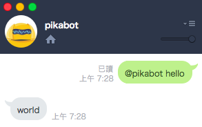
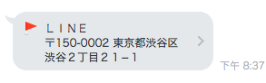
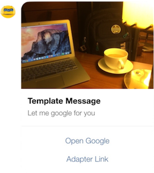
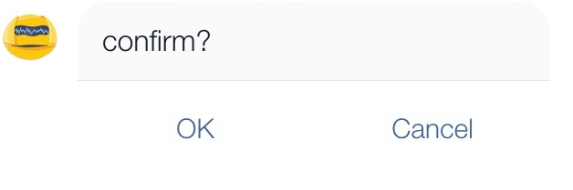
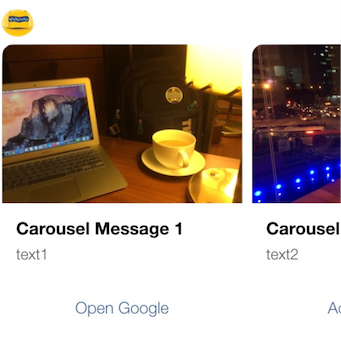

# hubot-line-messaging

[](https://travis-ci.org/puresmash/hubot-line-messaging)
[](https://github.com/puresmash/hubot-line-messaging/releases)
[](https://www.npmjs.com/package/hubot-line-messaging)
[](https://codecov.io/gh/puresmash/hubot-line-messaging)


This is a Hubot adapter for [Line Messaging API](https://business.line.me/zh-hant/services/bot) and it supports Line Business Center. This adapter currently only supports [Reply Message API](https://devdocs.line.me/en/?shell#reply-message), but will include more features recently.


## Installation

### Getting started

Because it is an adapter of hubot, first you must install hubot on your device. Follow the guidance on [hubot official document](https://hubot.github.com/docs/).

Then install this adapter to your project by running

```sh
npm install --save hubot-line-messaging
```

### Configuration

There are several environment variables need to be set in your Node.js server

```sh
HUBOT_NAME=${your_bot_name}
HUBOT_LINE_TOKEN=${your_token}
LINE_CHANNEL_SECRET=${CHANNEL_SECRET}
# optional
# If USER_PROFILE is SET (!==0), you can get additional user profile in res.message.user
USER_PROFILE=${USER_PROFILE}
```

If you are using Heroku, the command will be

```sh
heroku config:add HUBOT_NAME=${your_bot_name}
heroku config:add HUBOT_LINE_TOKEN=${your_token}
heroku config:add LINE_CHANNEL_SECRET=${CHANNEL_SECRET}
# optional
heroku config:add USER_PROFILE=${USER_PROFILE}
```

### Start robot

Once you configure environment variables on your system well, start your robot as bellow

```sh
./bin/hubot -a line-messaging
```

## Usage

### Hello World

Create a new file - robot.js under your `./scripts/` folder. Add customize scipts as following in your robot.js

```javascript
"use strict";

module.exports = function(robot){
    robot.respond(/hello/i, function(res){
        res.reply('world');
    });
}
```

Restart your robot, then send a message - `@botname hello` in line application. After that, you will receive a response - `world` in line application.



Notice that we support only REPLY MESSAGE API for now, so use `res.reply()` or `res.emote()` only. `res.send()` will reserved until PUSH MESSAGE API is officially supported.

## Listen Message from LINE

### Text Message

As mentioned in [Hubot's document](https://github.com/github/hubot/blob/master/docs/scripting.md#hearing-and-responding), if your robot's name is BB8, wake it up like below:

- @BB8 ${keyword}
- BB8, ${keyword}
- BB8: ${keyword}

It won't response unless you include robot's name in the beginning of your message.

### Complicated Message

Types of supports:

- ImageMessage
- VideoMessage
- AudioMessage
- LocationMessage
- StickerMessage

The following is an example of how to listen and respond to complicated message types (sticker, location, image, ...etc).

```javascript
var StickerMessage = require('hubot-line-messaging').StickerMessage

// Echo the same sticker to Line
// Customize a matcher for specific message type
var matcher = function(message){
    // Not implement listener, so should CatchAllMessage.message
    var stickerMsg = message.message;
    if (stickerMsg && stickerMsg.type && stickerMsg.type === 'sticker'){
        if(stickerMsg.stickerId === '1'){
            return true
        }
    }
    return false;
}
robot.listen(matcher, function(res){
    var stickerMessage = res.message.message;
    // This line is necessary to prevent error
    res.envelope.message = stickerMessage;
    var sticker = new SendSticker(stickerMessage.stickerId, stickerMessage.packageId);
    res.reply(sticker);
});
```

## Respond Basic Message to LINE

There are several message type which is defined in LINE's document. You can require one of those like below

```javascript
var LineMessaging = require('hubot-line-messaging')
var SendSticker = LineMessaging.SendSticker
var SendLocation = LineMessaging.SendLocation
var SendImage = LineMessaging.SendImage
var SendVideo = LineMessaging.SendVideo
var SendAudio = LineMessaging.SendAudios
var SendText = LineMessaging.SendText
```

**Text**

Text is a common message type, can call it in two way.

```javascript
// Generate a Text object
let text1 = new SendText('This is a text')
let text2 = new SendText('Second Line')

// Reply message
res.reply(text1, text2);
```

or

```javascript
// Simply using string
res.reply('This is a text', 'Second Line');
```

**Image**


```javascript
let originalContentUrl = 'https://placeholdit.imgix.net/~text?txtsize=45&txt=480%C3%97480&w=480&h=480';
let previewImageUrl = 'https://placeholdit.imgix.net/~text?txtsize=23&txt=240%C3%97240&w=240&h=240';

// Reply message
res.reply(new SendImage(originalContentUrl, previewImageUrl));
```

**Video**

```javascript
let originalContentUrl = 'https://example.com/original.mp4'
let previewImageUrl = 'https://example.com/preview.jpg'

// Reply message
res.reply(new SendVideo(originalContentUrl, previewImageUrl));
```

**Audio**

```javascript
let originalContentUrl = 'https://example.com/original.m4a'
let duration = 240000

// Reply message
res.reply(new SendAudio(originalContentUrl, previewImageUrl));
```

**Location**



```javascript
// title, address, latitude, longitude
let location =
    new SendLocation(
        'ＬＩＮＥ',
        '〒150-0002 東京都渋谷区渋谷２丁目２１−１',
        35.65910807942215,
        139.70372892916203
    );

// Send it as common way
res.reply(location);
```

**Sticker**


```javascript
// stickerId, packageId
let sticker = new SendSticker('1', '1');

// Send it as common way
res.emote(sticker);
```

## Respond Template Message to LINE

Template message is composed of template and actions.

### Mix Template and Actions

Template includes buttons, confirm and carousel. Actions includes postback, message and uri.

**Buttons**



```javascript
let msg = BuildTemplateMessage
    .init('this is a template msg')
    .buttons({
        thumbnailImageUrl: 'https://github.com/puresmash/chatting-robot/blob/develope/docs/template.jpg?raw=true',
        title: 'Template Message',
        text: 'Let me google for you'
    })
    .action('uri', {
        label: 'Open Google',
        uri: 'https://www.google.com.tw/'
    })
    .action('uri', {
        label: 'Adapter Link',
        uri: 'https://github.com/puresmash/hubot-line-messaging'
    })
    .build();
res.reply(msg);
```

**Confirm**



```javascript
let msg = BuildTemplateMessage
    .init('this is a confirm msg')
    .confirm({
        text: 'confirm?'
    })
    .action('uri', {
        label: 'OK',
        uri: 'https://www.google.com.tw/search?q=ok'
    })
    .action('message', {
        label: 'Cancel',
        text: 'cancel request'
    })
    .build();
res.reply(msg);
```

**Carousel**



```javascript
let msg = BuildTemplateMessage
    .init('this is a carousel msg')
    .carousel({
        thumbnailImageUrl: 'https://github.com/puresmash/chatting-robot/blob/develope/docs/template.jpg?raw=true',
        title: 'Carousel Message 1',
        text: 'text1'
    })
    .action('uri', {
        label: 'Open Google',
        uri: 'https://www.google.com.tw/'
    })
    .carousel({
        thumbnailImageUrl: 'https://github.com/puresmash/chatting-robot/blob/develope/docs/carousel.jpg?raw=true',
        title: 'Carousel Message 2',
        text: 'text2'
    })
    .action('uri', {
        label: 'Adapter Link',
        uri: 'https://github.com/puresmash/hubot-line-messaging'
    })
    .build();
res.reply(msg);
```

## Remark

Debug on Heroku

```sh
heroku config:add HUBOT_LOG_LEVEL=debug
heroku logs --tail
```
